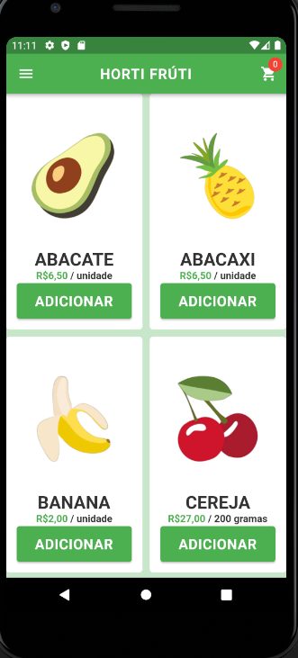
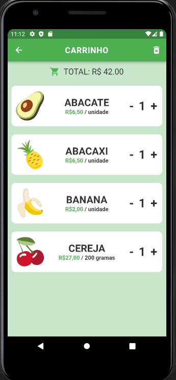
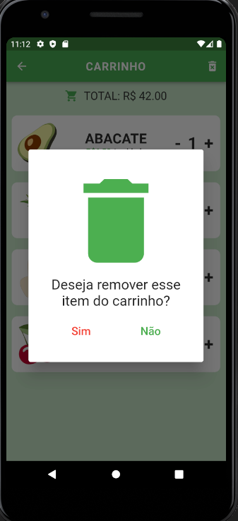
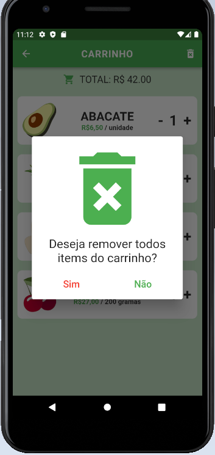

# App de Hortifrúti

Bem-vindo ao **App de Hortifrúti**! Um aplicativo para comprar produtos frescos de hortifrúti de forma conveniente.

## Funcionalidades

- Explore uma variedade de produtos frescos, como frutas e legumes.
- Adicione produtos ao seu carrinho de compras.
- Visualize detalhes dos produtos, incluindo preço e disponibilidade.
- Finalize a compra com facilidade.

## Capturas de Tela

- Tela inicial.
  

- Tela do carrinho.
  

- Tela de remover um item.
  

- Tela de remover todos os itens.
  

- Tela do carrinho vazio.
  

## Tecnologias Utilizadas

O **App de Hortifrúti** utiliza as seguintes tecnologias e conceitos:

- Flutter para o desenvolvimento do aplicativo móvel.
- Gerenciamento de estado com ChangeNotifier para controlar e atualizar o estado do aplicativo.
- Arquitetura MVC (Model-View-Controller) para organizar a estrutura do projeto.
- Comunicação com API utilizando HTTP para buscar e enviar dados.
- SharedPreferences para armazenar dados locais de forma simples.
